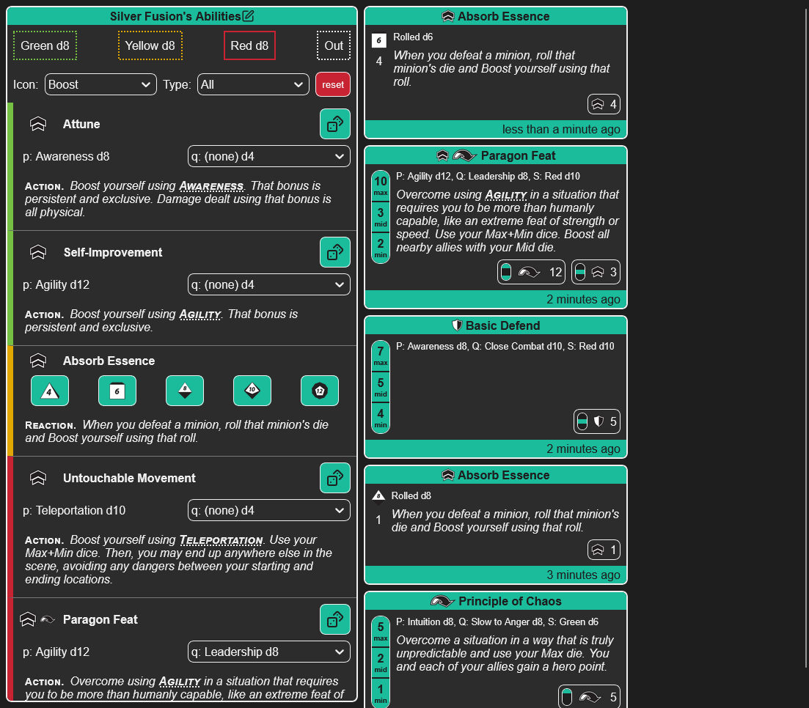

# NDX: Sentinel Comics RPG Dice Roller

NDX is a browser-based dice roller for the Sentinel Comics RPG. It's currently only really useful for players (sorry GMs), but I hope to add tools for GM support in the future.



- [NDX: Sentinel Comics RPG Dice Roller](#ndx-sentinel-comics-rpg-dice-roller)
	- [Another dice roller? But _why_?](#another-dice-roller-but-why)
	- [Features](#features)
	- [Future plans](#future-plans)
	- [What it _isn't_](#what-it-isnt)
	- [How to use](#how-to-use)
	- [Creating a character](#creating-a-character)
		- [Saving your character](#saving-your-character)
		- [Format](#format)
		- [Dice sizes](#dice-sizes)
		- [Powers \& Qualities](#powers--qualities)
		- [Status](#status)
		- [Abilities](#abilities)
			- [Identity](#identity)
			- [Required](#required)
				- [Generic rolls](#generic-rolls)
			- [Effects](#effects)
				- [Icons](#icons)
				- [Dice](#dice)
				- [Powers without rolls](#powers-without-rolls)
		- [Description](#description)
	- [Known bugs](#known-bugs)
	- [Contributing](#contributing)
	- [Running the application yourself](#running-the-application-yourself)
		- [Running in Docker](#running-in-docker)
			- [Initial setup](#initial-setup)
			- [Running the dev server](#running-the-dev-server)

## Another dice roller? But _why_?

Well, two reasons.

1. I really like making dice rollers. I've probably reinvented this particular wheel dozens of times over the course of my life.
2. More importantly, the way SCRPG uses dice is unique and I haven't been able to find a single dice roller that does a remotely serviceable job of rolling dice for this game. At best, some of them at least show the 3 individual die rolls and don't add too much additional clutter.

## Features

- Define your character's powers, skills, and abilities.
- Only shows the abilities you have access to based on your current status.
  - Filter based on type and/or effect. Find your reactions or overcome abilities quickly!
- Shows both the actual min, mid, and max rolls; and also the summed up values for each of your ability's effects, along with effect icons to make the results easy to parse at a glance.
- Character is saved to your device, so you can come back and it'll still be there.
- No Internet dependence beyond loading the page. No waiting on servers. You click a button, you get your result instantly!
- Dark and light mode, automatically set based on your system's settings!

## Future plans

- Save multiple characters
- GM mode
- Mobile support
- Full offline mode! Save it to your device like an app! No Internet access? No problem!
- More user-friendly character creation

## What it _isn't_

- Not a full character manager! You'll still need some paper or something!
- Worth using on mobile! This is something I absolutely intend to implement, but initial development is focused on large screens.
- Pretty! I'm trained on bits, not pixels!
- AI-enabled! Sorry, CEOs and tech bros!
- Filled with ads! This is a passion project! Fuck hustle culture! Make shit for fun and share it for free!
- Extensively tested! But, like, I have _some_ tests! And some TODO comments reminding me to make others! So that's something!
- Looking for contributions! Once I get the core features implemented I _may_ open it up to PRs.
  - But hey, the source is _right here_! When my AuDHD-addled brain enevitably gets bored with this, you can fork it and continue where I left off! You can even

## How to use

The application is available at https://asmor.github.io/ndx/. Just hit that link and you're good to go.

## Creating a character

Click the edit button in the title of the Abilities section to edit the character. Characters are defined via plain text with specific formatting, as described below.

### Saving your character

The character is saved automatically when you click "Set Character" in the editing window. It's saved to your browser's local storage, so it will be there when you come back or if you reload the page.

Currently only a single character is supported at a time. I intend to allow storing multiple characters in the future. In the mean time, you could always copy the text and save it in notepad or whatever your preffered format is, then paste it back in to swap characters.

### Format

The first two lines _must_ be the character's name followed by a blank line.

After that, there are four sections which can be put in any order; Powers, Qualities, Status, and Abilities. All sections are required.

Each section must be separated by blank lines, and you can not have any blank lines within a section.

The first line of each section should be the name of the section.

Here's an example of a minimal template:

```
Johnny Hero

Powers

Qualities

Status 6, 8, 10

Abilities
```

### Dice sizes

In the powers, qualities, and status sections you will need to list dice. Dice can be written with or without a `d` (i.e. `d6` and `6` are equivalent). Only dice of sizes 4, 6, 8, 10, or 12 are allowed.

### Powers & Qualities

The Powers and Qualities sections consist of their heading (`Powers` or `Qualities`), followed by each power or quality on its own line in the format `Power Name d6` or `Power Name 8`.

Example:

```
Powers
Cosmic 10
Mind Tentacles 8
Telekinesis 10
Remote Viewing 8
Absorption 8

Qualities
Self-Discipline 12
Otherworldy Mythos 8
Siren's Song 8
```

### Status

The status section always consists of a single line; the word "Status" followed by 3 dice, indicating respectively the green, yellow, and red status dice for the character.

Example:

```
Status 6, 8, 10
```

This indicates a Green d6, Yellow d8, and Red d10.

### Abilities

This is where things get complicated. Sorry. I swear it's not too bad, though!

Let's start with a look at an example ability and I'll break down its format.

```
g:Psychic Assault :: p:Telekinesis :: a:d h:n :: Attack using Telekinesis. Hinder the target using your Min die.
```

First thing to note is that this line can be broken into four distinct sections separated by double colons

- [Identity:](#identity) `g:Psychic Assault` = a Green (`g`) power named Psychic Assault.
- [Required:](#required) `p:Telekinesis` = Requires the power (`p`) Telekinesis. Make sure the power or quality is listed in the appropriate section and you match its spelling exactly!
- [Effects:](#effects) `a:d h:n` = Two effects; an attack (`a`) using mid die (`d`); and a hinder (`h`) using min die (`n`)
- [Description:](#description) `Attack using Telekinesis. Hinder the target using your Min die.` = Uhh... I feel like this one's kind of self explanatory?

Note that for each ability, only the identity and effects are required. So for example if you were putting in a Principle ability (which never have requirements) and didn't feel like typing up the description, you could just write `g:Principle of the Sea :: o:x`.

Now let's talk about how each of these sections are defined.

#### Identity

Always the first section of the ability. **Mandatory.**

- A letter for the color (`g`reen, `y`ellow, `r`ed, or `o`ut)
- Optionally followed by a letter for the ability type (`a`ction, `r`eaction, `i`nherent). If you provide the type, it will be displayed in the ability and you can filter on it.
- Then a colon, and the name of the ability.

Examples:

- `ga:None shall pass!`
- `yr:I've had worse.`
- `ri:It's just a flesh wound.`
- `o:Alright. We'll call it a draw.`

#### Required

Must be the second section, if present. **Optional.**

- Much like Identity above, the first character (`p`, `q`, or `*`) indicates whether the requirement is a power, a quality, or generic. See [generic rolls](#generic-rolls) below.
- Then a colon, and the name of the power or quality.
- **IMPORTANT!** Make sure the power or quality is listed in the appropriate section, and **the name exactly matches**! If you have the quality `Siren's Song d10`, you must refer to it as `q:Siren's Song`. `q:Sirens Song` will **not** work.
- For abilities which only roll a single power or quality die, add an exclamation point after the p or q. E.g. `p!:Cosmic`.

##### Generic rolls

There are a small number of abilities, like Absorb Essence (core rules page 69[\*](https://i.imgur.com/6zeve8L.gif)), which don't roll a die based on your own powers or qualities. In this case, set a single `*` character as "required".

Example: `y:Absorb Essence :: * :: b:d`

#### Effects

Here's the fun part, the effects! Also the most cryptic part, and probably looks the scariest.

An effect consist of icons, a colon, and dice, each represented by 1 or more letters. `d:d` means "defend icon, mid die". `hr:x` means "hinder and recover icon, max die`.

An ability can have multiple effects, which are separated by spaces and/or commas. `a:d h:n` gives two separate effects, an attack with the mid die and a hinder with the min die.

##### Icons

|  |  |  |  |  |  |         |
| :------------------------------------------------------------: | :------------------------------------------------------------: | :-----------------------------------------------------------: | :------------------------------------------------------------: | :--------------------------------------------------------------: | :-------------------------------------------------------------: | :-----: |
|                              `a`                               |                              `d`                               |                              `b`                              |                              `h`                               |                               `o`                                |                               `r`                               |   `-`   |
|                             attack                             |                             defend                             |                             boost                             |                             hinder                             |                             overcome                             |                             recover                             | no icon |

**Note:** `-` is special, and indicates the effect has no icon. `-` only works if it's the only "icon" for that effect. e.g. `-:d`, but not `-a:d`.

##### Dice

| Min | Mid | Max |
| :-: | :-: | :-: |
| `n` | `d` | `x` |

Specifying multiple dice will cause them to be added together. e.g. `a:dx` is an attack with Mid+Max.

**Tip:** Hey, this thing is called NDX! What a weird coincidence. Also, how is this a tip?

##### Powers without rolls

You can also create a power without any rolls by setting effects to `-`. This is mostly so that you can define all your powers (like inherents) so you don't lose track of them during the game.

Examples:

- `r:Push Your Limits :: - :: Whenever your limits wouldn't be pushed... push 'em.`
- `g:Hope you remember what this does :: -`

### Description

Always the last section, if present. **Optional.**

Should be pretty self explanatory. Whatever you write here will be shown in the abilities list and in any rolls made with the ability. Pretty much anything flies here. Except double colons, which the app uses to help decode the ability. So don't put `::` in your description. Or do. IDGAF, it's your ability.

## Known bugs

- Currently, none

## Contributing

At the moment, I'm not accepting pull requests. That may change in the future. If you have any concerns or suggestions, [open an issue](https://github.com/Asmor/ndx/issues).

## Running the application yourself

### Running in Docker

This project includes a `Dockerfile` and `docker-compose.yml` that let you run the development server inside a containerized Node.js environment.

#### Initial setup

1. **Clone the repo**

   ```bash
   git clone https://github.com/asmor/ndx.git
   cd ndx
   ```

2. **Build and start the container**

   ```bash
   docker-compose up -d
   ```

3. **Open a shell inside the container**

   ```bash
   docker exec -it scrpg-pwa-dev bash
   ```

   Alternatively, if you're using VSCode it should prompt you to install the Dev Containers addon (if you don't already have it) and then it should be able to connect to the container.

4. **Install dependencies (inside the container)**
   ```bash
   npm install
   ```

#### Running the dev server

Inside the container, run:

```bash
npm run dev
```

The app should be available at [http://localhost:5173](http://localhost:5173) in your browser.
